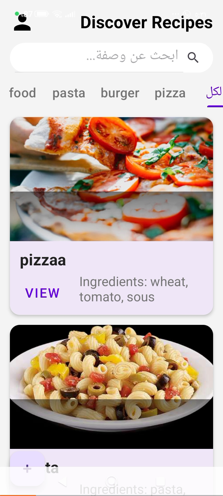

# 📌 كتاب الوصفات - Recipe Book

## 📝 وصف المشروع
تطبيق **Recipe Book** هو تطبيق هواتف ذكية (Mobile Application) مخصص لعشاق الطبخ، يتيح للمستخدمين استكشاف وتصفح مجموعة متنوعة من الوصفات الشهية. يتميز التطبيق بتجربة مستخدم سلسة وآمنة؛ حيث يتعين على المستخدمين الجدد إنشاء حساب أولاً، ثم تسجيل الدخول للوصول إلى مكتبة الوصفات وتصفح مكوناتها وخطوات تحضيرها.

---

## 🛠️ التقنيات المستخدمة
تم تطوير هذا التطبيق باستخدام بيئة العمل والتقنيات التالية:
* **بيئة التطوير (IDE):** Android Studio
* **لغة البرمجة:** Java
* **تصميم الواجهات (UI):** XML
* **أدوات التطوير وإدارة النسخ:** Git, GitHub

---

## 📸 لقطات شاشة (Screenshots)
فيما يلي لقطات شاشة توضح واجهات التطبيق ومراحل تجربة المستخدم على الهاتف:

| الواجهة | لقطة الشاشة (Screenshot) | وصف الواجهة |
| :---: | :---: | :--- |
| **إنشاء الحساب وتسجيل الدخول** |  | تم تصميم هذه الواجهة لتمكين المستخدمين الجدد من إنشاء حساب آمن، أو تسجيل الدخول للمستخدمين الحاليين للوصول إلى التطبيق. |
| **تفاصيل الوصفة** |  | تعرض هذه الواجهة المكونات الدقيقة، المقادير، وخطوات التحضير بالتفصيل للوجبة المختارة. |
| **تصفح الوصفات الرئيسية** |  | تعرض هذه الواجهة القائمة الكاملة لكتاب الوصفات المتاحة، حيث يستطيع المستخدم استكشاف الوجبات المتنوعة. |

---

## 🚀 خطوات التشغيل
اتبع الخطوات التالية لتشغيل التطبيق وتجربته عبر Android Studio:

1. **فتح المشروع:**
   * افتح برنامج **Android Studio**.
   * اختر **Open** ثم حدد مجلد مشروع كتاب الوصفات الخاص بكِ.
2. **مزامنة المشروع (Gradle Sync):**
   * انتظر حتى ينتهي البرنامج من عمل `Gradle Sync` وتحميل المكتبات اللازمة للمشروع.
3. **التشغيل:**
   * قم بتوصيل هاتفك المحمول عبر كابل الـ USB أو قم بتشغيل المحاكي (Emulator).
   * اضغط على زر **Run (المثلث الأخضر)** في القائمة العلوية لتثبيت التطبيق وتشغيله فوراً.

---

## 👨‍💻 إعداد الطالبة
* **اسم الطالبة:** ديمة رائد سلامة الشرفا
* **الرقم الجامعي:** 220235232
