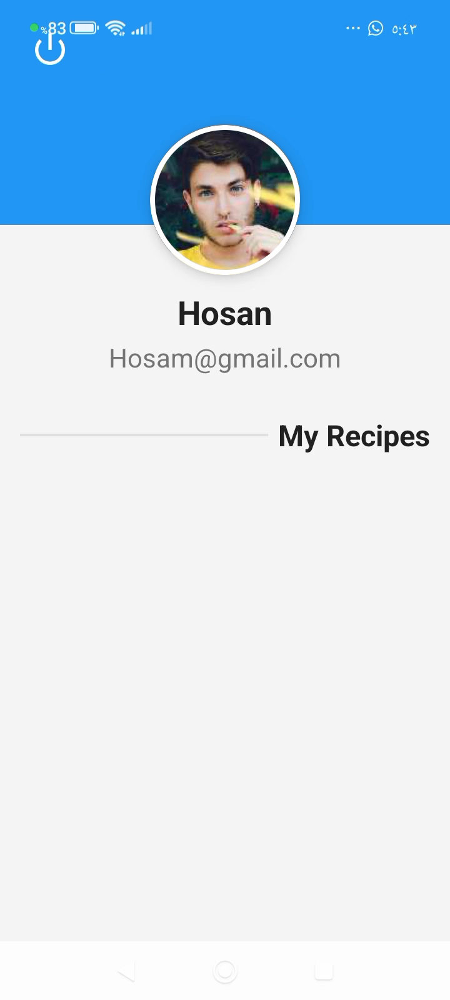
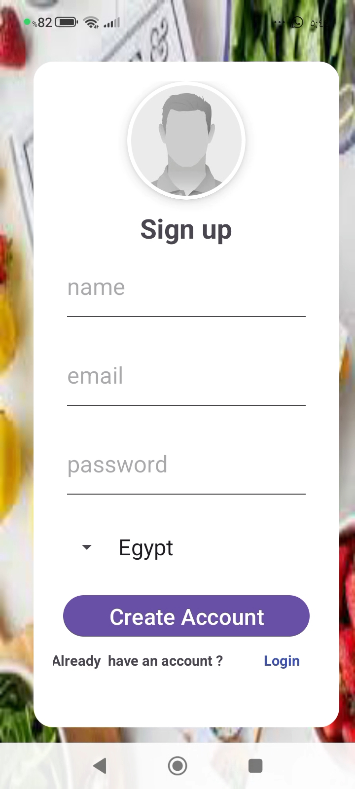
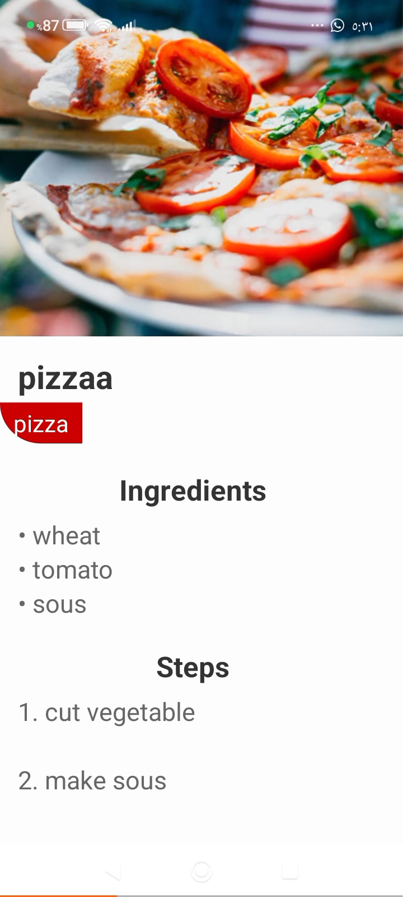

## 🍳 Recipe Book - كتاب الوصفات  

## 📝 وصف المشروع (App Description)
تطبيق أندرويد متكامل يتيح للمستخدمين مشاركة واكتشاف وحفظ وصفات الطبخ في بيئة تفاعلية تشبه منصات التواصل الاجتماعي. 
يمكن للمستخدمين تسجيل الدخول وإنشاء حسابات بشكل آمن، ومن ثم نشر وصفاتهم الخاصة مدعومة بالصور والخطوات التفصيلية. 
يحتوي التطبيق على واجهة رئيسية قابلة للتمرير (Scrollable Feed) مع ميزة البحث الذكي لتصفح الأطباق حسب الاسم أو التصنيف، بالإضافة إلى ملف شخصي لكل مستخدم يعرض الوصفات التي قام بالمساهمة بها.

---

## 🛠️ التقنيات المستخدمة (Technologies Used)
تم تطوير هذا التطبيق باستخدام بيئة العمل والتقنيات التالية:
* **بيئة التطوير (IDE):** Android Studio
* **لغة البرمجة:** Java
* **قاعدة البيانات والخدمات السحابية:** Firebase (Authentication, Realtime Database/Firestore, Storage)
* **تصميم الواجهات (UI):** XML
* **أدوات التطوير وإدارة النسخ:** Git & GitHub

---

## 📸 لقطات من التطبيق (Screenshots)
<table align="center">
  <tr>
    <td></td>
    <td></td>
    <td></td>
    <td></td>
  </tr>
</table>

---

## 🚀 خطوات التشغيل (How to Run)
اتبع الخطوات التالية لتشغيل التطبيق وتجربته عبر Android Studio:

1. **فتح المشروع:**
   * افتح برنامج Android Studio.
   * اختر **Open** ثم حدد مجلد مشروع كتاب الوصفات الخاص بكِ.
2. **مزامنة المشروع (Gradle Sync):**
   * انتظر حتى ينتهي البرنامج من عمل *Gradle Sync* وتحميل المكتبات اللازمة للمشروع.
3. **التشغيل:**
   * قم بتوصيل هاتفك المحمول عبر كابل الـ USB أو قم بتشغيل المحاكي (Emulator).
   * اضغط على زر **Run** (المثلث الأخضر) في القائمة العلوية لتثبيت التطبيق وتشغيله فوراً.

---

## 🎓 معلومات الطالبة (Student Information)
* **اسم الطالبة:** ديمة رائد سلامة الشرفا
* **الرقم الجامعي:** 220235232
